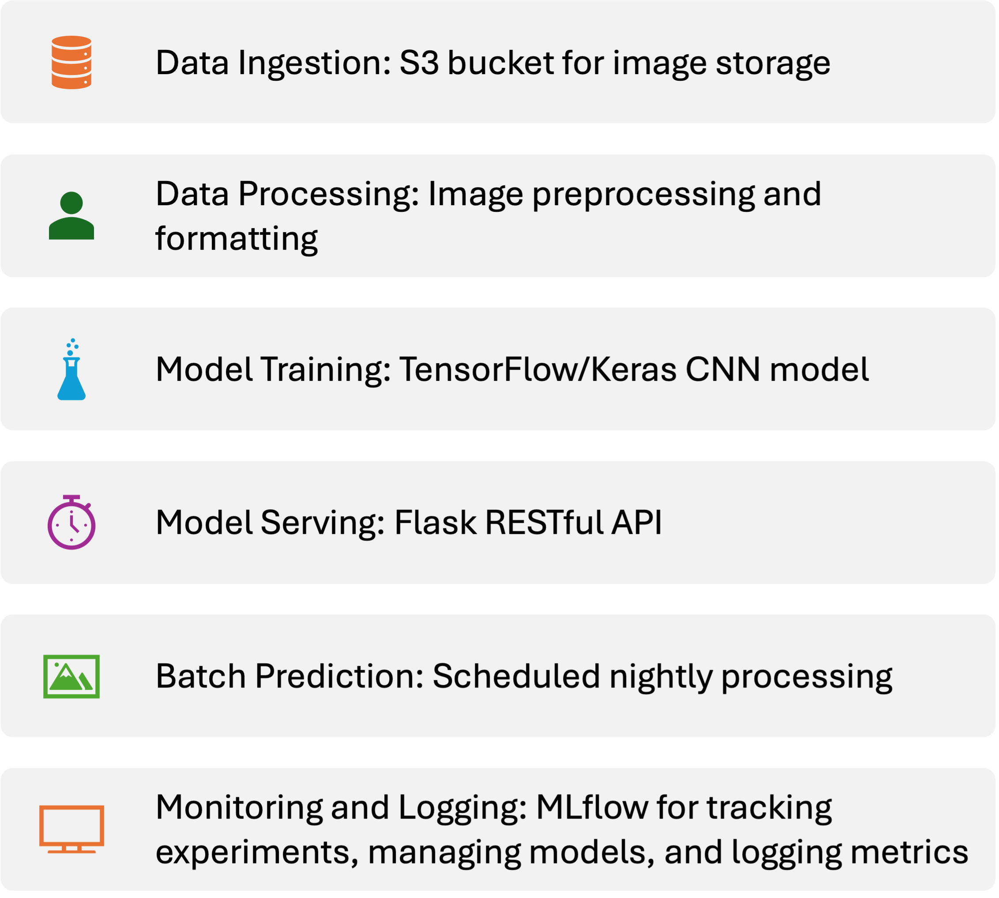

# Refund Item Classifier

This project automates the sorting of returned items for an online shopping platform using machine learning. The system categorizes items based on their images and runs as a service that can be triggered in batches overnight.

## Project Overview

The Refund Item Classifier addresses the challenge of categorizing returned items for a rapidly growing online shopping platform for sustainable products. As the volume of returns increases, the need for manual sorting has become unsustainable. This project aims to automate the classification of refund items using machine learning, reducing the workforce and associated costs.

### Key Features

- **Automated Image Classification**: Utilizes a machine learning model to classify returned items based on their images.
- **Batch Processing**: Runs as a batch service, processing new data overnight to ensure timely categorization.
- **RESTful API**: Provides endpoints for real-time predictions, system health checks, performance metrics, and model drift detection.
- **Monitoring and Logging**: Integrates with MLflow for tracking experiments, managing models, and logging metrics.
- **Resource Utilization Monitoring**: Tracks CPU and memory usage to ensure efficient resource management.
- **Model Drift Detection**: Monitors the model's performance over time and detects significant deviations from the baseline distribution.

### Benefits

- **Efficiency**: Automates the sorting process, reducing manual effort and speeding up the handling of returns.
- **Scalability**: Capable of processing large volumes of data in batch mode, making it suitable for high-traffic e-commerce platforms.
- **Real-Time Monitoring**: Provides real-time insights into system performance and health, ensuring smooth operation and quick issue resolution.
- **Adaptability**: Detects model drift and allows for timely retraining, ensuring the model remains accurate and reliable over time.

This project is designed to streamline the returns process, making it more efficient and cost-effective for the online shopping platform.

## Conceptual Architecture

The Refund Item Classifier system is designed with the following components:

1. **Data Ingestion**: Images of returned items are uploaded to an S3 bucket.
2. **Data Processing**: Images are downloaded from S3, converted to a standard format, and preprocessed for model training.
3. **Model Training**: A machine learning model is trained on the processed images using TensorFlow/Keras and logged to MLflow.
4. **Model Serving**: The trained model is served using a Flask RESTful API, which handles prediction requests.
5. **Batch Processing**: The system performs batch predictions on new data every night using a scheduled job.
6. **Monitoring and Logging**: MLflow is used for tracking experiments, managing models, and logging metrics.

### Data Source

The dataset used for training the model is sourced from [Kaggle's Fashion MNIST dataset](https://www.kaggle.com/zalando-research/fashionmnist). This dataset contains 70,000 grayscale images of 10 categories of clothing items, which are used to train and evaluate the model.

### Visual Overview

Below is a visual representation of the system architecture:



This diagram shows the flow of data and processes between different components of the system.

## Table of Contents
- [Project Overview](#project-overview)
- [Conceptual Architecture](#conceptual-architecture)
- [Prerequisites](#prerequisites)
- [Setup](#setup)
- [Data Ingestion](#data-ingestion)
- [Data Processing](#data-processing)
- [Model Training](#model-training)
- [Model Serving](#model-serving)
- [Testing the API](#testing-the-api)
- [Batch Prediction](#batch-prediction)
- [Scheduling Batch Predictions](#scheduling-batch-predictions)
- [Monitoring Components](#monitoring-components)
- [MLflow Integration](#mlflow-integration)
- [Troubleshooting](#troubleshooting)
- [Contributing](#contributing)
- [License](#license)

## Prerequisites

Ensure you have the following installed:
- Python 3.x
- pip (Python package installer)
- AWS CLI (for S3 access)

### Installing AWS CLI

To install the AWS CLI, follow the instructions [here](https://docs.aws.amazon.com/cli/latest/userguide/install-cliv2.html).

### Configuring AWS CLI

After installing the AWS CLI, configure it with your credentials:
```sh
aws configure
```

## Setup

1. **Clone the Repository**:
   ```sh
   git clone <repository_url>
   cd fashion_mnist_project
   ```

2. **Set Up a Virtual Environment** (optional but recommended):
   ```sh
   python3 -m venv venv
   source venv/bin/activate  # On Windows use `venv\Scripts\activate`
   ```
3. **Install Dependencies**:
   Install the required Python packages using pip:
   ```sh
   pip install -r requirements.txt
   ```

4. **Start MLflow UI**:
   Before running any scripts, start the MLflow tracking server:
   ```sh
   mlflow ui
   ```
   This will start the MLflow UI on `http://localhost:5000`.

## Data Ingestion

1. **Upload Images to S3**:
   Ensure your images are in the `data/raw` folder. Run the following script to upload images to your S3 bucket:
   ```sh
   python data_ingestion/ingest.py
   ```

## Data Processing

1. **Download and Process Images**:
   Download images from S3, convert them to a standard format, and save them locally:
   ```sh
   python data_processing/process.py
   ```

## Model Training

1. **Train the Model**:
   Train the machine learning model using the processed images:
   ```sh
   python model_training/train.py
   ```
   This script will log training parameters, metrics, and the model to MLflow.

2. **View Training Results**:
   Open your web browser and navigate to `http://localhost:5000` to view your experiments, runs, and metrics in the MLflow UI.

## Model Serving

1. **Start the Flask API**:
   Serve the trained model using Flask:
   ```sh
   python model_serving/app.py
   ```
   The API will be available at `http://127.0.0.1:5001`.

## Testing the API

1. **Test Prediction Endpoint**:
   Use `curl` to test the API with a sample image:
   ```sh
   curl -X POST -F "file=@data/processed/test/0_1.png" http://127.0.0.1:5001/predict
   ```

2. **Check Health Endpoint**:
   Verify the health of the application:
   ```sh
   curl http://127.0.0.1:5001/health
   ```

3. **Monitor Metrics**:
   Check the current metrics of the application:
   ```sh
   curl http://127.0.0.1:5001/metrics
   ```

4. **Check Drift Status**:
   Monitor the model drift status:
   ```sh
   curl http://127.0.0.1:5001/drift-status
   ```

## Batch Prediction

1. **Run Batch Predictions**:
   Perform batch predictions on new images:
   ```sh
   python batch_prediction/batch_predict.py
   ```
   This script will log the total number of predictions and the average prediction value to MLflow.

2. **View Batch Prediction Results**:
   Check the MLflow UI again to see the logged metrics from the batch prediction run.

## Scheduling Batch Predictions

1. **Set Up a Cron Job**:
   To automate batch predictions, set up a cron job to run the script every night at midnight:
   ```sh
   crontab -e
   ```
   Add the following line:
   ```sh
   0 0 * * * /usr/bin/python3 /path_to_your_repo/batch_prediction/batch_predict.py
   ```

## Monitoring Components

The project includes several monitoring components:

1. **Performance Monitoring**: Tracks requests per minute and processing time per request.
2. **Resource Utilization**: Monitors CPU and memory usage.
3. **Health Checks**: Provides an API endpoint for system health.
4. **Model Drift Detection**: Compares current and baseline distributions using the Kolmogorov-Smirnov test.

These components can be accessed through the `/metrics`, `/health`, and `/drift-status` endpoints.

## MLflow Integration

This project uses MLflow for experiment tracking and model management. MLflow is integrated into the following scripts:

- `model_training/train.py`: Logs training parameters, metrics, and the trained model.
- `model_serving/app.py`: Automatically loads the latest trained model and logs predictions.
- `batch_prediction/batch_predict.py`: Logs batch prediction metrics.

You can use the MLflow UI to compare different runs, view performance metrics, and manage your models throughout the machine learning workflow.

## Troubleshooting

If you encounter any issues:
1. Ensure all dependencies are correctly installed.
2. Check that the MLflow UI is running before executing other scripts.
3. Verify that your AWS credentials are correctly set up for S3 access.
4. If the Flask API fails to start, ensure no other process is using port 5001.

For more detailed information about each script, refer to the comments within the code files.

## Contributing

We welcome contributions to the Refund Item Classifier! If you would like to contribute, please follow these guidelines:

1. Fork the repository.
2. Create a new branch for your feature or bugfix.
3. Make your changes and commit them with clear and concise messages.
4. Push your changes to your fork.
5. Submit a pull request to the main repository.

Please ensure that your contributions adhere to the project's coding standards and include appropriate tests.

## License

This project is licensed under the MIT License. See the [LICENSE](LICENSE) file for more details.
